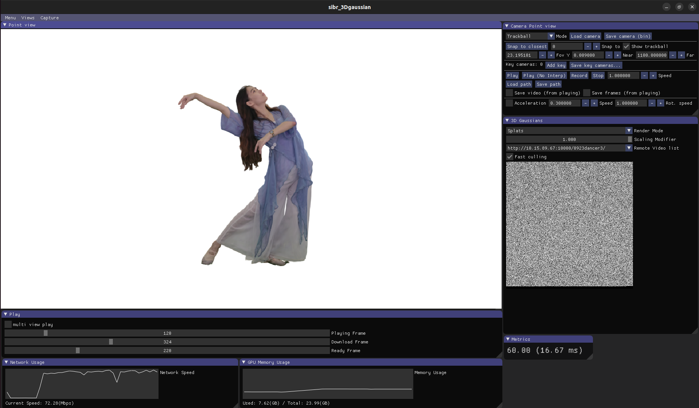

# Streaming Volumetric Video SIBR Viewer for V3: Viewing Volumetric Videos on Mobiles via Streamable 2D Dynamic Gaussians

Official implementation of the streaming volumetric video viewer for _V^3: Viewing Volumetric Videos on Mobiles via Streamable 2D Dynamic Gaussians_.

**[Penghao Wang*](https://authoritywang.github.io/), [Zhirui Zhang*](https://github.com/zhangzhr4), [Liao Wang*](https://aoliao12138.github.io/), [Kaixin Yao](https://yaokxx.github.io/), [Siyuan Xie](https://simonxie2004.github.io/about/), [Jingyi Yu†](http://www.yu-jingyi.com/cv/), [Minye Wu†](https://wuminye.github.io/), [Lan Xu†](https://www.xu-lan.com/)**

**SIGGRAPH Asia 2024 (ACM Transactions on Graphics)**

| [Webpage](https://authoritywang.github.io/v3/) | [Paper](https://arxiv.org/pdf/2409.13648) | [Video](https://youtu.be/Z5La9AporRU?si=P95fDRxVYhXZEzYT) | [Training Code](https://github.com/AuthorityWang/VideoGS) | [SIBR Viewer Code](https://github.com/AuthorityWang/VideoGS_SIBR_viewers) | [IOS Viewer Code](https://github.com/AuthorityWang/VideoGS_SIBR_viewers) |<br>


Please note that the SIBR viewer is only tested on Ubuntu, maybe not work for other platforms due to the video codec. 

## Installation

```
# Dependencies
sudo apt install -y libglew-dev libassimp-dev libboost-all-dev libgtk-3-dev libopencv-dev libglfw3-dev libavdevice-dev libavcodec-dev libeigen3-dev libxxf86vm-dev libembree-dev libcurl4-openssl-dev ffmpeg ninja-build
# Project setup
cd VideoGS_SIBR_viewers
cmake -Bbuild . -DCMAKE_BUILD_TYPE=Release # add -G Ninja to build faster
cmake --build build -j24 --target install
```

## Usage

Please setup a nginx server in the internal network to serve as a streaming server, and put converted video data on the nginx server. 

Then modify the network address in `src/projects/gaussianviewer/renderer/GaussianView.hpp`, rebuild it and run it. 

Command:
```
./install/bin/SIBR_gaussianViewer_app -m xxx(Path to the frame 0 ckpt)
```
You need to pass the first frame ckpt to the viewer, as the viewer needs the camera.json to initialize the view. 

## Control

The main control is same as 3DGS SIBR viewer. 

For dynamic play, click the button `multi view play` in `Play` to play the video. You can also change the frame by dragging the slider `playing frame`in `Play` panel. To change the video, select the remote server link of `Remote Video list` in `3D Gaussians` planel. 

## Code illustration

We maintain arrays storing multi frame gaussians at `src/projects/gaussianviewer/renderer/GaussianView.hpp`, including
```
pos_cuda_array
rot_cuda_array
scale_cuda_array
opacity_cuda_array
shs_cuda_array
```
and change the frame index to play dynamic volumetric videos. 

There are 3 threads will be lanuched when the viewer lanuched:
- Thread 1 is for rendering. 
- Thread 2 is for downloading the videos from the server and convert to gray scale images, this is implemented by OpenCV at `src/projects/gaussianviewer/renderer/OpenCVVideoDecoder.hpp`, we also implement a decoder with FFmpeg at `src/projects/gaussianviewer/renderer/GSVideoDecoder.hpp`, but we use the one with OpenCV in default.
- Thread 3 is for converting images to gaussian data, which is implemented at `src/projects/gaussianviewer/renderer/GaussianView.cpp` function `readyVideo_func`. This function including data dequantization, convert to gaussian data, and memory copy to cuda. Please NOTE that for decoder efficiency, we remove the morton sort, normalize quaternion, expoentiate scale, activate alpha. Instead, we implement these steps when we compress the gaussian ckpt to videos after training. 

## Acknowledgement

This viewer is based on the original [gaussian-splatting viewer](https://github.com/graphdeco-inria/gaussian-splatting). 

If you found our work useful, please kindly cite our paper:

```
@article{wang2024v,
  title={V\^{} 3: Viewing Volumetric Videos on Mobiles via Streamable 2D Dynamic Gaussians},
  author={Wang, Penghao and Zhang, Zhirui and Wang, Liao and Yao, Kaixin and Xie, Siyuan and Yu, Jingyi and Wu, Minye and Xu, Lan},
  journal={ACM Transactions on Graphics (TOG)},
  volume={43},
  number={6},
  pages={1--13},
  year={2024},
  publisher={ACM New York, NY, USA}
}
```